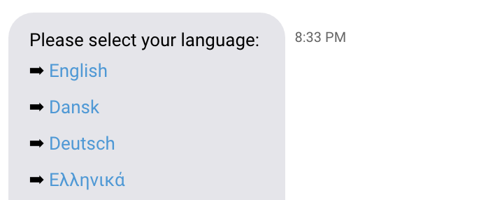
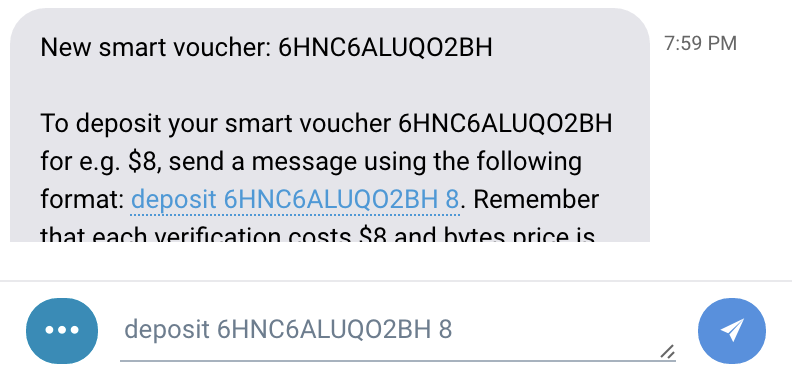

# Quick Start

To begin developing any app which is based on headless-obyte, first thing to do is to set up your machine, install Node.js and tools. [Complete guide of preparing your blank Debian-based machine for Obyte development](tutorials-for-newcomers/setting-up-headless-wallet.md). You can skip this step if you are familiar with Node.js development and already know how to do it in your way.

Create a new node.js package for your chatbot: `npm init`. You will definitely need modules from `ocore` and if you are going to send payments, you will also need `headless-obyte`. Your `package.json` should list these dependencies:


```javascript
"dependencies": {
    "headless-obyte": "git+https://github.com/byteball/headless-obyte.git",
    "ocore": "git+https://github.com/byteball/ocore.git"
}
```


Now run `npm install` to fetch dependencies.

Full configuration options are described in [Configuration](configuration.md) section. As for now, in your configuration file \(conf.js in project folder or conf.json in user folder\) switch your app to light node and add hub URL:


```javascript
exports.bLight = true;
exports.hub = process.env.testnet ? 'obyte.org/bb-test' : 'obyte.org/bb';
```


If you want to connect to testnet network instead of spamming mainnet for development then you can do that by adding `.env` file, which should contain just one line:

```text
testnet=1
```

## Sending / receiving txs:


```javascript
var headlessWallet = require('headless-obyte');
var eventBus = require('ocore/event_bus.js');

function onReady() {
    let amount = 1; //in bytes
    let user_address = "62SU7724ME5MWB7VEP64VURYZHDRSDWN"; // wallet address
    let user_device_address = null; // device address
    headlessWallet.issueChangeAddressAndSendPayment(null /*asset, null for bytes*/, amount, user_address, user_device_address, (err, unit) => {
        if (err){
            return console.error(err);
        }
        // handle successful payment
    });

    // received new payment
    eventBus.on('new_my_transactions', (arrUnits) => {
        // handle new unconfirmed units here
        // at this stage, payment is not yet confirmed
    });

    // payment is confirmed
    eventBus.on('my_transactions_became_stable', (arrUnits) => {
        // handle payments becoming confirmed
    });
};
eventBus.once('headless_wallet_ready', onReady);
```


Go ahead and run the code: `node index.js`. You'll see initialization lines printed by ocore in console, which contain your wallet first address printed and an error saying that `There are no funded addresses`. This is our failed attempt to `issueChangeAddressAndSendPayment()`, as you don't have any bytes in your wallet yet.

We wrapped all of our code in 'headless\_wallet\_ready' event handler, at this point the private keys of your wallet are decrypted and are ready for use.

Find out in console output your first address.

```text
====== my first address: 2PJHQKMP7NH6MUYUQPZ4S46C2Q7CQI32
```

You can deposit some bytes on it to be able to make outbound transactions. Right after ocore is done with initialization \(`onReady function`\), we send one byte to some address. First argument is an `asset`, its the asset you are paying in \(`null` for bytes\), `amount` is payment amount in the smallest units. If the payment was successful, you get its `unit` in the callback and can save it or watch further events on this unit.

There are many other functions for sending payments, for example sending multiple payments in multiple assets at the same time, see `exports` of [https://github.com/byteball/headless-obyte/blob/master/start.js](https://github.com/byteball/headless-obyte/blob/master/start.js).

The `new_my_transactions` and `my_transactions_became_stable` event handlers are to be invoked after any new transaction received to any of your wallet addresses and when this transactions become stable, respectively. `arrUnits` is an array of units \(more accurately, unit hashes\) that contained any transaction involving your addresses. The event `new_my_transactions` is triggered for outgoing transactions too, you should check if the new transaction credits one of the addresses you are expecting payments to.

The above events work in both full and light nodes. If your node is full, you can alternatively subscribe to event `mci_became_stable` which is emitted each time a new main chain index \(MCI\) becomes stable:


```javascript
eventBus.on('mci_became_stable', function(mci){
    // check if there are any units you are interested in 
    // that had this MCI and react to their becoming stable
});
```


## Simple chat bot

Every Obyte wallet can be paired with any other Obyte wallet, because every wallet has it's unique pairing code. Headless wallet will print it's pairing code to console right after the launch. Depending on what kind of app you want to build, you will or will not need this pairing code. Simplest operations on Obyte platform require no chat bot \(like sending/receiving txs, for example\).

For more handy interaction with your userbase, you mostly surely need to write a chat bot, to set up direct interaction between your clients Obyte apps and your wallet \(this process is called 'pairing'\). Chat bot is Obyte wallet which can receive chat messages and react to them. Clients can pair and chat with your chat bot inside their Obyte wallet app, your task is to handle incoming messages and act accordingly. Through chat, users can provide to your chat bot their addresses, KYC profiles, or any other information with couple of clicks.

You can use `bot-example` repository as a starting point for your chat bot. You can also use the module from previous step, but it will require you to add some more config lines, so its better to `git clone git@github.com:byteball/bot-example.git`, remove .git folder `rm -fr bot-example/.git` and tweak some default configs there \(remember to give a name to your bot, switch to light node, set up a pairing secret, etc.\)

When you start your node, it will print its full pairing code:

```text
====== my pairing code: A2WMb6JEIrMhxVk+I0gIIW1vmM3ToKoLkNF8TqUV5UvX@obyte.org/bb#0000
```

The pairing code consists of your node's public key \(device public key\), hub address, and pairing secret \(after \#\).

Publish this pairing code anywhere as a link with `byteball:` scheme, users will be able to open a chat with your bot by clicking your link \(the link opens in their Obyte app and starts a chat\):

```markup
<a href="byteball:A2WMb6JEIrMhxVk+I0gIIW1vmM3ToKoLkNF8TqUV5UvX@obyte.org/bb#0000">Chat with my test bot</a>
```

You also need this pairing code to add your bot to the [Bot Store](https://medium.com/byteball/byteball-bot-store-has-launched-c546e9e38ab5).

When a user pairs his device with your bot \(e.g. by clicking the link to your bot\), you receive a pairing notification and can welcome the user:


```javascript
eventBus.on('paired', function(from_address, pairing_secret){
    var device = require('ocore/device.js');
    device.sendMessageToDevice(from_address, 'text', 'Hi! I am bot.');
});
```


The behavior of your event handler can depend on `pairing_secret`, the second argument of the event handler. For example, you can have a one-time \(non-permanent\) pairing secret equal to session ID on your website; after the user clicks the pairing link and opens chat, you can link his chat session with his web session, see [Authenticating users on websites](tutorials-for-newcomers/log-in-on-website-with-byteball.md).

### Receiving chat messages

To receive chat messages, subscribe to 'text' events on event bus:


```javascript
eventBus.on('text', function(from_address, user_message){
    // your code here
});
```


`from_address` is user's device address \(not to be confused with payment addresses\), `user_message` is their message.

### Sending chat messages

Messages to user's device can be sent with `sendMessageToDevice` function in `device` module:


```javascript
var device = require('ocore/device.js');
var message_to_user = 'Message from bot to user';
device.sendMessageToDevice(user_device_address, 'text', message_to_user);
```


So, in case we want to echo back what user wrote, we could combine those two above examples into this:


```javascript
var eventBus = require('ocore/event_bus.js');
var device = require('ocore/device.js');

eventBus.on('text', function(from_address, user_message){
    device.sendMessageToDevice(from_address, 'text', user_message);
});
```


Great success, we now have a bot, which is like a parrot \(repeating everything you wrote to it\).

### Predefined chat commands

To give access to predefined commands, format your responses this way:

```text
click this link: [Command name](command:command code)
```

The user will see the text in square brackets "Command name", it will be highlighted as a link, and when the user clicks it, his app will send `command code` text to your bot. 

### Command suggestion

Sometimes you might want to suggest the command without actually sending it immediately, so user could have the possibility to edit the command before sending, this could be done like this:

```text
Example command: we suggest to [buy (number) apples](suggest-command:buy 5 apples)
```

Here is how the result looks like:  


## Next step

That's it. You've completed your first chat bot on Obyte platform. You can check other chat bot examples provided by our team:

* [Bot example](https://github.com/byteball/bot-example): start from here
* [Faucet](https://github.com/byteball/obyte-faucet): sending payments
* [ICO bot](https://github.com/byteball/ico-bot): sending and receiving payments
* [Merchant](https://github.com/byteball/obyte-merchant): receiving payments without storage of private keys
* [Flight delay insurance](https://github.com/byteball/flight-delays-insurance): offering contracts
* [Internal asset exchange](https://github.com/byteball/obyte-exchange): offering contracts
* [GUI wallet](https://github.com/byteball/obyte-gui-wallet): not a bot, but you'll find code for offering contracts

Now you are ready to make something useful, go ahead to our Tutorials section and carefully read all of them to get better understanding of Obyte code API. [Tutorials for newcomers](tutorials-for-newcomers/).

