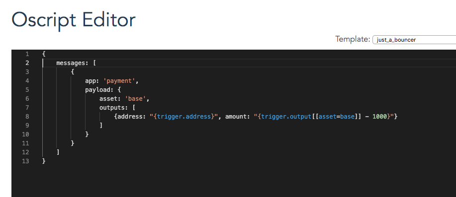

# Autonomous Agents

An Autonomous Agent \(AA\) is a special address \(account\) on the ledger that acts according to a program associated with it. Its behavior is similar to that of a vending machine that receives coins and data entered on a keypad and in response, releases a cup of coffee, plays a song, or does whatever it was programmed to do.

[Getting started developer guide](getting-started-guide.md)

[Introduction to Autonomous Agents](https://medium.com/obyte/introducing-autonomous-agents-6fe12fb12aa3) \(announcement post on Medium\)

## Oscript — the language of autonomous agents

Autonomous Agents are written in Oscript — a new programming language developed specifically for this purpose. The language is very simple and any developer who has experience in curly-brace languages such as JavaScript, PHP, Java, C/C++, etc should not have any difficulty learning it.

Some of the features of the language:

* convenient access to variables that describe the state of the ledger and the triggering \(requesting, activating\) transaction received. That’s what makes the language domain-specific. In particular, the following variables are available:
* amounts received in the triggering transaction;
* data received in the triggering transaction;
* who sent the triggering transaction;
* state variables of the current and other AAs;
* data feeds;
* attestations;
* balances of this and other AAs;
* information about assets;
* arithmetic operations;
* logical operations \(AND, OR, etc\);
* comparisons;
* concatenations;
* some math functions;
* some cryptography functions for calculating hashes and validating signatures created off-chain;
* branching with if/else;
* no loops \(just iteration methods for objects and arrays\);
* no recursive functions;
* scalar and object data types;
* generation of deterministic pseudo-random number from seed.

[Oscript language reference for Autonomous Agents](oscript-language-reference.md)

AA code can be deployed with [Oscript](https://oscript.org)[ \(mainnet\)](https://oscript.org)[ editor](https://oscript.org) and [Oscript](https://testnet.oscript.org/)[ \(testnet\)](https://testnet.oscript.org/)[ editor](https://testnet.oscript.org/). There is also a [extension for VS Code](https://marketplace.visualstudio.com/items?itemName=obyte.oscript-vscode-plugin) and [Autonomous Agent testkit](https://github.com/valyakin/aa-testkit).

