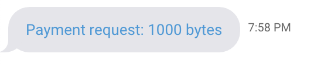

# Payments and transactions

## Requesting payments

When you include a valid Obyte address anywhere in the text of your response to the user, the address will be automatically highlighted in the user's chat window, and after clicking it the user will be able to pay arbitrary amount of arbitrary asset to this address.

When you want to request a specific amount of a specific asset, format your payment request this way:

```text
Any text before [payment description, will be ignored](obyte:USER_WALLET_ADDRESS?amount=123000&asset=base) any text after
```

Example: 

Amount is in the smallest units, such as bytes. If you omit `&asset=...` part, base asset \(bytes\) is assumed. If you want to request payment in another asset, indicate its identifier such as `oj8yEksX9Ubq7lLc+p6F2uyHUuynugeVq4+ikT67X6E=` for blackbytes \(don't forget to url-encode it\).

You will likely want to generate a unique payment address per user, per transaction. This code sample might help:

```javascript
var headlessWallet = require('headless-obyte');
eventBus.once('headless_wallet_ready', () => {
    headlessWallet.issueNextMainAddress((user_wallet_address) => {
        // send it over to the user
        device.sendMessageToDevice(user_device_address, 'text',
            '[...](obyte:'+ user_wallet_address +'?amount=123000&asset=base)');
    });
});
```

### Payments from single address wallet

It is possible to request that the payment would be done from any single address wallet or specific single address wallet. This works only in chat messages.

```text
[...](obyte:USER_WALLET_ADDRESS?amount=1&single_address=1)
[...](obyte:USER_WALLET_ADDRESS?amount=1&single_address=singleUEPO3OD2TUUJUOECVMKVSRHRDJ4ST2FS)
```

## Waiting for payments

If you include a headless wallet

```javascript
var headlessWallet = require('headless-obyte');
```

you can get notified when any of your addresses receives a payment

```javascript
eventBus.on('new_my_transactions', function(arrUnits){
	// fetch more data about my addresses
	db.query("SELECT outputs.address, amount, asset FROM outputs \
			JOIN my_addresses USING (address) \
			WHERE unit IN(?);", [arrUnits], (rows) => {
		if (rows.length === 0) return;
		rows.forEach((row) => {
		    // react to each unconfirmed payment
		});
	});
});
```

`arrUnits` is an array of units \(more accurately, unit hashes\) that contained any transaction involving your addresses. The event `new_my_transactions` is triggered for outgoing transactions too, you should check if the new transaction credits one of the addresses you are expecting payments to.

## Waiting for finality of payments

To get notified when any of your transactions become stable \(confirmed\), subscribe to `my_transactions_became_stable` event:

```javascript
eventBus.on('my_transactions_became_stable', function(arrUnits){
	// fetch more data about my addresses
	db.query("SELECT outputs.address, amount, asset FROM outputs \
			JOIN my_addresses USING (address) \
			WHERE unit IN(?);", [arrUnits], (rows) => {
		if (rows.length === 0) return;
		rows.forEach((row) => {
		    // react to each confirmed payment
		});
	});
});
```

`arrUnits` is again the array of units that just became stable and they contained at least one transaction involving your addresses.

The above events work in both full and light nodes. If your node is full, you can alternatively subscribe to event `mci_became_stable` which is emitted each time a new main chain index \(MCI\) becomes stable:

```javascript
eventBus.on('mci_became_stable', function(mci){
    // check if there are any units you are interested in 
    // that had this MCI and react to their becoming stable
});
```

## Sending payments

To send payments, you need to include a headless wallet

```javascript
var headlessWallet = require('headless-obyte');
```

and use this function after the headless wallet becomes ready:

```javascript
eventBus.once('headless_wallet_ready', () => {
    headlessWallet.issueChangeAddressAndSendPayment(asset, amount, user_wallet_address, user_device_address, (err, unit) => {
        if (err){
            // something went wrong, maybe put this payment on a retry queue
            return;
        }
        // handle successful payment
    });
});
```

`asset` is the asset you are paying in \(`null` for bytes\), `amount` is payment amount in the smallest units. If the payment was successful, you get its `unit` in the callback and can save it or watch further events on this unit.

There are many other functions for sending payments, for example sending multiple payments in multiple assets at the same time, see `exports` of [https://github.com/byteball/headless-obyte/blob/master/start.js](https://github.com/byteball/headless-byteball/blob/master/start.js).

