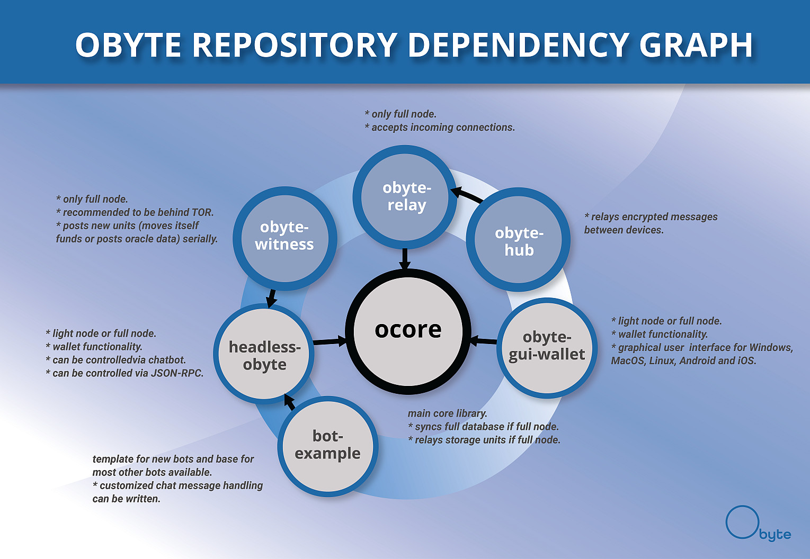

# Tutorials for newcomers

## Type of repositories on Obyte Github page

Obyte Github page is located there [https://github.com/byteball](https://github.com/byteball)

### ocore - main core library

* syncs full database if full node.
* relays storage units if full node.

### obyte-gui-wallet - wallet apps with GUI

* inherits `ocore` library.
* light node or full node.
* wallet functionality.
* graphical user interface for Windows, MacOS, Linux, Android and iOS.

### headless-obyte - wallet for server without GUI

* inherits `ocore` library.
* light node or full node.
* wallet functionality.
* can be controlled via chat.
* can be controlled via [JSON-RPC service](../json-rpc/running-rpc-service.md).

### obyte-witness - nodes that determine the main chain

* inherits `headless-obyte` and `ocore` library.
* only full node.
* recommended to be behind TOR.
* post new units \(moves itself funds or posts oracle data\) serially.

### obyte-relay - peer that can be connected directly

* inherits `ocore` library.
* only full node.
* accepts incoming connections.
* provides new units, stable units, balances & suitable parents to light nodes.
* notifies wallet apps about new witnesses.

### obyte-hub - hub that relays chat messages

* inherits `obyte-relay` and `ocore` library.
* relays encrypted chat messages between devices.
* notifies wallet apps about new app version.
* shows list of chat bots that are available to pair with.
* shows metadata about assets.

### bot-example - template for new bots

* inherits `headless-obyte` and `ocore` library.
* customized [chat messages handling](../list-of-events.md#a-new-message-string-type-message-has-been-received) can be added.
* customized actions on [new transactions](../list-of-events.md#new-unstable-unit) and [stable transactions](../list-of-events.md#stable-unit) can be added.

## Tutorials to setup a node

* [Setting up headless wallet \(Debian/Ubuntu Linux\)](setting-up-headless-wallet.md)
* [Setting up headless wallet with Docker image](https://github.com/byteball/headless-obyte#docker-image)
* [Setting up headless wallet on Raspberry Pi](https://medium.com/obyte-help/running-obyte-wallet-on-headless-raspberrypi-3-56007da32739)

## Examples of using these libraries

* [Ping-poing payments](ping-pong-paymets.md)
* [Logging into website](log-in-on-website-with-byteball.md)
* [Weather oracle](weather-oracle.md)
* [Bet on weather bot](bet-on-weather-bot.md)

