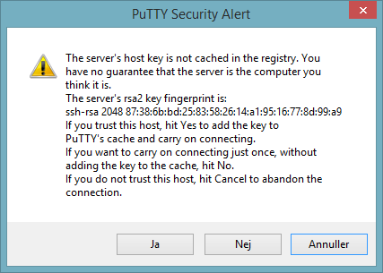

# Setting up headless wallet

Setting up a Headless wallet is required for those wanting to build their own chat bots. That is, if they want to host the bot on their own server, at least. This guide will take you through the installation in a step by step process but won’t venture into how to build the chat bot itself. There are several possibilities to rent a Virtual Private Server \(VPS\) and apart from a fairly fast SSD storage there are not a lot of requirements.

The first thing you should consider, is whether you want to run your bot on a full node or a light node. When setting up the server, the choice to run on a full node will mean you need to make sure to have enough disk space available. The installation is the same whether you run a full node or a light node, but running a full node will allow your bot to have access to all units ever posted to the DAG and thereby be able to perform more complex tasks. If light wallet is enough for you and have no interest in renting a VPS then you can run a light [Obyte headless wallet also on Raspberry Pi 3+](https://medium.com/@alvarlaigna/running-obyte-wallet-on-headless-raspberrypi-3-56007da32739).

Most VPS providers allow you to choose an operating system, and since this guide will be based on Debian 9, you might want to find a provider that offers this as one of their options. Since I will be running a full node, I also must make sure to have enough disk space available and that it is on SSD, since HDD will be too slow. At the time of writing this guide, the required disk space for the full Obyte DAG is about 38 GB but always make sure to have enough or at least the option to add more, should you need it.

* 1 server \(with Debian in this case\)
* At least 50-70 GB of fast SSD disk space \(HDD is too slow for initial syncing\)
* 1 GB RAM \(hubs/relays that accept incoming connections might need up to 4GB\)

## Setting up the server.

Having created the server, I need to connect to the server. I use a super lightweight SSH terminal called “putty” from my Windows laptop.\(available on [https://www.putty.org](https://www.putty.org)\)


First time you log on, you will see a notice that you have not connected to this host before. Click “Yes” to save the key.



You are now logged on to your server:


Running the headless wallet as root is not recommended, so the first thing I do, is create the user we will run the hub as. I chose the username “obyte”.

`adduser obyte`

I will be installing all prerequisites as root for this guide. Only the actual headless wallet stuff will be installed from the user we just created. For now, stay logged in as root.

## The fundamentals

First, we need some basic tools. To make sure we get the newest versions, first run an update of the apt tool:  
`apt update`

Then install following software:  
`apt-get install -y git curl software-properties-common`

To make sure all binaries build properly, we need the build-essentials as well:  
`apt-get install -y build-essential`

Now log on with the user we initially created \(`obyte` in this example\)  
`su -l obyte`

The headless wallet is based on nodejs, and one of the easiest way to control node versions is by the script called “nvm”. Just fire these three commands, and you’re all set \(make sure not to miss any of the backticks in the above\):  
``nvm_version=`curl --silent -L https://api.github.com/repos/nvm-sh/nvm/releases/latest | /usr/bin/awk '/tag_name/ { print $2 }' | /bin/sed 's/[",]//g'`  
curl -o- https://raw.githubusercontent.com/nvm-sh/nvm/$nvm_version/install.sh | bash``

\(thanks to [http://blog.mobnia.com/installing-node-with-nvm-on-a-debian-server/](http://blog.mobnia.com/installing-node-with-nvm-on-a-debian-server/) for the above two commands\)

Then exit user, log in again and install version 10 of nodejs:  
`exit    
su -l obyte    
nvm install 10`

Build tools for Windows can be installed with following command \(you need to run PowerShell or CMD.exe as Administrator to install this\):  
 `npm install --global --production windows-build-tools`

You will also need [node-gyp](https://github.com/nodejs/node-gyp#installation) for cases where the pre-built binaries \(secp256k1, sqlite, rocksdb\) are not available for your system configuration. That you can install with this command:  
`npm install -g node-gyp`

## Installing the Headless Wallet

So far so good - we’re now almost ready to start actually installing the headless wallet. But first. We need to find the repository that we want to clone. Go to [https://github.com/byteball/headless-obyte](https://github.com/byteball/headless-byteball) and click the “Clone or download” button:


Copy the URL from there and clone the repository

`git clone https://github.com/byteball/headless-obyte.git`

It creates a directory called headless-obyte.

`cd headless-obyte`

Then install it

`npm install`

## Configuring and starting your headless wallet

In your .config folder, you should create a file called conf.json and edit it. It will contain values that is used by the headless wallet. They override the values that you can find in the file called conf.js located in your headless-obyte folder.

`mkdir -p ~/.config/headless-obyte    
nano ~/.config/headless-obyte/conf.json`

I will briefly explain each of the entries, you should put in the file \(if you’re not familiar with the structure of a json object, you could check out sites such as jsoneditoronline.org\)

There is also a detailed explanation of the values on [https://github.com/byteball/headless-obyte](https://github.com/byteball/headless-obyte) at the section called “Customize”.

### deviceName config

This is pretty much self explanatory. The name of your device. This is the name that others will see when they pair with your bot. It’s not to be confused with the bot’s name, which you will have to have the Obyte hub-operator create for you.

### permanent\_pairing\_secret config

This is the part that goes after the \# in your pairing invitation that you will use from your control device - usually a GUI wallet.

### control\_addresses config

This is one of the two most important settings. This is an array of device addresses \(not wallet addresses\) that are allowed to control your headless wallet and request payments from it. You will most likely want to control the headless wallet from a GUI wallet on a phone or desktop. You find the device address by clicking the burger-menu and clicking “Settings” and then scrolling down to the section saying “Device Address” on the wallet\(s\) you want to be able to connect to the headless wallet from.


### payout\_address config

The other important setting is the payout\_address which is the wallet address that the bot is allowed to send funds to. When a device with the correct device address requests the bot to send a payment of X bytes, the bot automatically pays it to the wallet you specify here. If you are installing the bot to allow users to send funds to it or to be part of smart contracts that it will potentially withdraw from, you might want to periodically send funds away from the headless wallet and into another wallet you control.

### bLight config

This setting determines whether your headless wallet will run as a full node or a light node. If your bot needs access to all transactions on the DAG, you will need to run a full node. Therefore, in most cases, this should be set to `false`.

The final file would look something like this:


```javascript
{
  "deviceName": "Obyte Denmark",
  "permanent_pairing_secret": "0000",
  "control_addresses": [
    "DEVICE_ADDRESS_1",
    "DEVICE_ADDRESS_2",
    "DEVICE_ADDRESS_3"
  ],
  "payout_address": "YOUR_WALLET_ADDRESS",
  "bLight": false
}
```


## Wallet is ready to be started

That’s it, your headless wallet is now ready to be started. If you set bLight = false; your wallet will start synchronizing the entire DAG. This can take a long time depending on the speed of your server and particularly the SSD disk.

To make sure the process doesn’t run out of memory \(which can cause crashes\) you should manually assign additional memory to the nodejs process:

`node --max-old-space-size=4096 start.js`

### Run on background using "bg" and "fg"

#### Send to background

`ctrl+z  
bg`

#### Stop the headless wallet

`fg    
ctrl+c`

### Run on background using “screen”

It might just be me, but I always found that a better way to leave processes running even after I log off the server, is to use the program `screen`. It’s super easy to use. So I suggest, that even though the bot say you can send the process to the background by using `ctrl+z` and `bg`, i have a harder time separating the various background processes. So I suggest you simply do this:

`sudo apt-get install screen`

This allows you to start, detach and re-attach screens as you please.

#### Start a new screen

`screen` - run it when you have detached from screen and want to start a totally new screen.

#### Send screen to background

`ctrl+a and d` - this detaches from screens and sends it to background \(be careful not to miss pressing `a` before `d`.

#### Resuming a screen from background

`screen -r` - this reattaches to most recently started screen. If you have started multiple then use `screen -list` to get a list of all started screens and then reattached with `screen -r PPID`

#### Stop the headless wallet

`ctrl+d` - while attached to screen, this terminates the screen and stops the headless wallet

### Run on background non-interactively

If you are unable to enter a passphrase every time the wallet starts and/or are willing to accept the security risks, set `bNoPassphrase` to `true` and daemonize the app when starting:

#### Starting the daemon

```text
node start.js 1>log 2>errlog &
```

#### Stopping the daemon

Checking if `node` runs

`ps -ef | { head -1; grep node; }`  or `ps -fp $(pgrep -d, -x node)`

`kill PID` - sends SIGTERM command to terminate the process by PID number.

## Useful extras

Since Obyte runs on an SQLite database by default, which is [located in user data folder](../configuration.md), you might want to be able to explore the data stored yourself, thereby making it easier to create the logic for the bot if you need to access data in the databases. If you wish to [setup Obyte to use MySQL database instead](../configuration.md#conf-storage) then that can be changed with a configuration file.  
`apt-get install sqlite3`

### Monitoring logs

Checking the log to see if things are running \(by default, log file is in [same folder as configuration](../configuration.md)\):

`tail -f ~/headless-obyte/log.txt`

### Disabling logs

By default, headless wallets are set to write logs into a file, but you make them to write to console instead by setting `logToSTDOUT` configuration to `true`.

If don't wish to get the logs to console and you also would like to disable writing the log file then this can be done by adding a variable like this to the configuration file:


```javascript
{
    "logToSTDOUT": false,
    "LOG_FILENAME": "/dev/null"
}
```


## Documentation

Full documentation for headless Obyte node can be found there  
[https://byteball.github.io/headless-obyte/](https://byteball.github.io/headless-obyte/)

